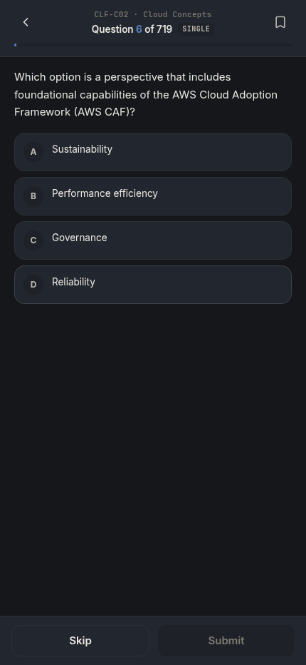
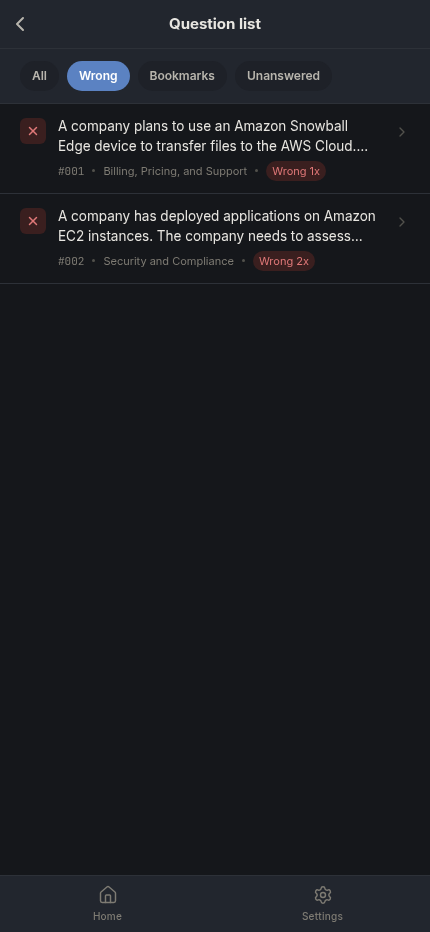
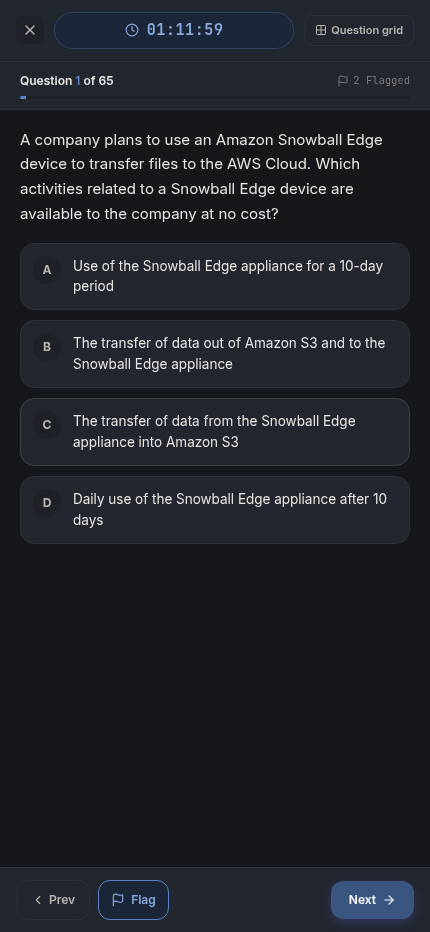
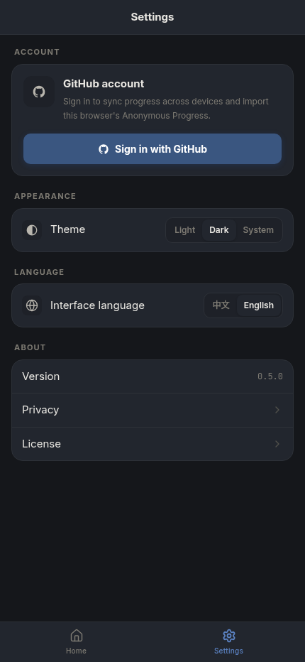

# ace-aws

<p align="center">
  
</p>

<p align="center">
  <strong>A focused practice app for AWS certification prep.</strong>
</p>

<p align="center">
  <a href="https://aws.hiback.net">Live demo</a>
  ·
  <a href="./README.zh-CN.md">中文</a>
</p>

<p align="center">
  
  
  
  
</p>

ace-aws is a mobile-first AWS certification practice app. It keeps the experience simple: pick a certification, answer questions, review mistakes, save bookmarks, and run a timed mock exam when you are ready.

Anonymous progress stays in your browser. Sign in with GitHub when you want progress sync across devices.

> ace-aws is an independent study tool and is not affiliated with Amazon Web Services.

## Preview

The home screen is fully bilingual.

| English | Chinese |
| --- | --- |
|  |  |

## Features

### Practice Questions

Work through the question bank with a clean, distraction-free mobile layout. Single-choice and multiple-choice questions are supported, with bilingual question text and explanations.

<p align="center">
  
</p>

### Wrong Answer Review

Mistakes stay easy to find. Revisit wrong answers, restart a focused wrong-answer round, and use the list views to jump back into specific questions.

<p align="center">
  
</p>

### Mock Exam

Run a timed mock exam that mirrors the pressure of the real test: countdown timer, answer sheet, question flags, save-and-exit, and a final score report.

<p align="center">
  
</p>

### Settings and Sync

Use guest mode for local-only study, or sign in with GitHub to sync progress. Switch theme and language at any time.

<p align="center">
  
</p>

## What You Can Study

ace-aws currently supports:

- AWS Certified Cloud Practitioner: `CLF-C02`
- AWS Certified Developer - Associate: `DVA-C02`
- English and Chinese UI
- Local guest progress
- GitHub sign-in for cross-device progress sync
- Bookmarks, wrong-answer review, smart practice, and mock exams

More AWS certifications are planned for future updates.

## Try It

Open the hosted demo:

**https://aws.hiback.net**

You can continue as a guest without creating an account. GitHub sign-in is only needed when you want synchronized progress.

## Deploy Your Own

ace-aws ships as a Docker Compose stack with the app and PostgreSQL.

### 1. Prepare a Server

You need:

- Docker and Docker Compose
- A domain name or reverse proxy target
- A GitHub OAuth App if you want sign-in and sync

### 2. Create a GitHub OAuth App

Set these values in the GitHub OAuth App:

- Homepage URL: your public app URL, for example `https://ace.example.com`
- Authorization callback URL: `https://ace.example.com/api/auth/callback/github`

### 3. Configure Environment Variables

Create a `.env` file next to `docker-compose.yml`:

```env
AUTH_GITHUB_ID=replace-with-github-oauth-client-id
AUTH_GITHUB_SECRET=replace-with-github-oauth-client-secret
AUTH_SECRET=replace-with-openssl-rand-base64-32
AUTH_URL=https://ace.example.com

POSTGRES_DB=ace-aws
POSTGRES_USER=ace_aws
POSTGRES_PASSWORD=replace-with-strong-postgres-password
```

Generate `AUTH_SECRET` with:

```bash
openssl rand -base64 32
```

### 4. Start the App

```bash
docker compose pull
docker compose up -d
```

The app listens on port `3000`. Put it behind your preferred HTTPS reverse proxy, such as Caddy, Traefik, nginx, or a platform ingress.

## Privacy

- Guest progress is stored only in the browser.
- Signed-in progress is stored in your self-hosted PostgreSQL database.
- GitHub sign-in is used for identity and sync; it is not required for guest study.

## License

MIT. See [LICENSE](./LICENSE).
