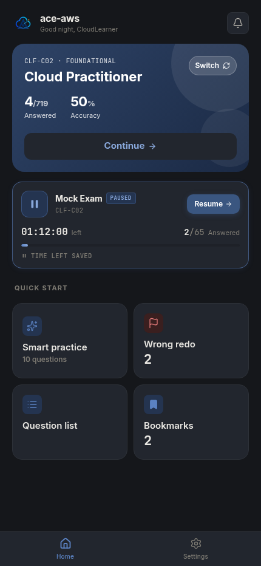
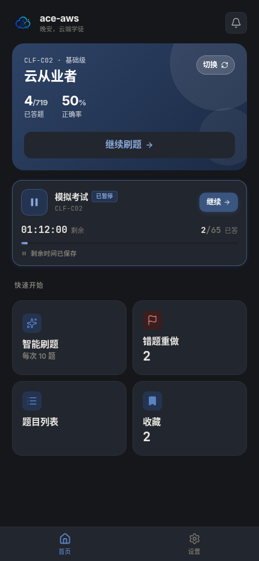
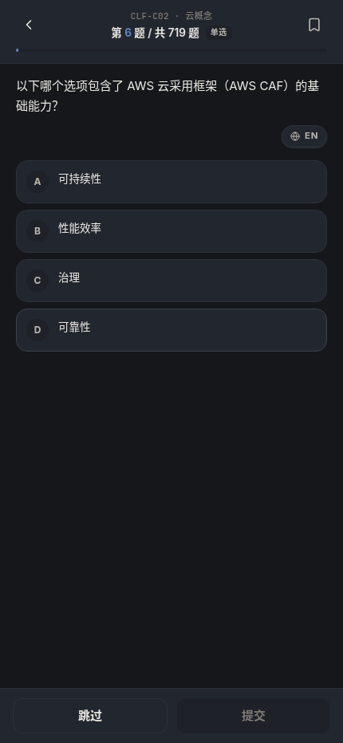
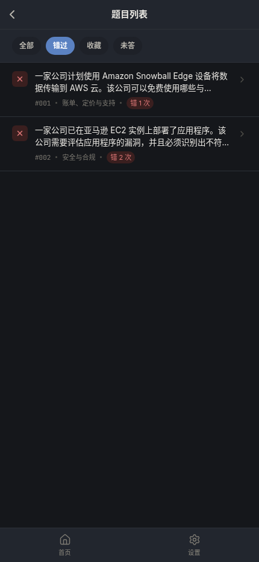
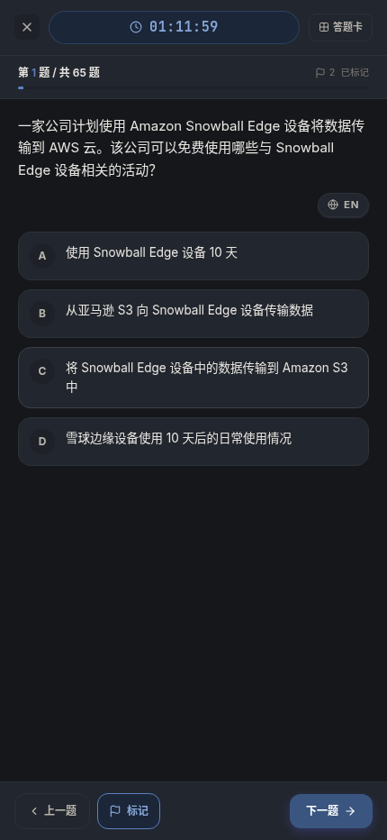
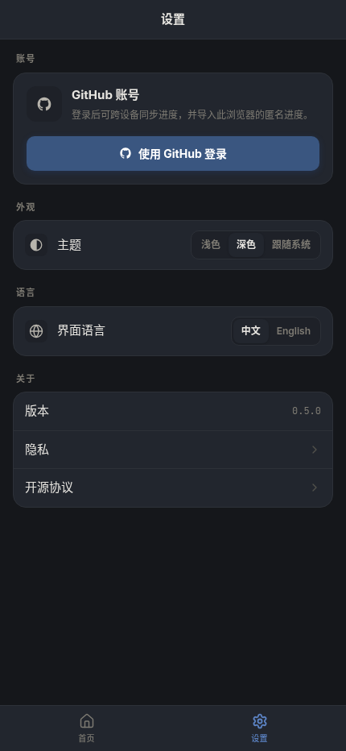

# ace-aws

<p align="center">
  
</p>

<p align="center">
  <strong>专注的 AWS 认证刷题应用。</strong>
</p>

<p align="center">
  <a href="https://aws.hiback.net">在线体验</a>
  ·
  <a href="./README.md">English</a>
</p>

<p align="center">
  
  
  
  
</p>

ace-aws 是一个移动端优先的 AWS 认证刷题应用。它把体验压缩到最常用的学习动作：选择认证、刷题、复习错题、收藏重点题，并在准备好时进入限时模拟考试。

游客进度只保存在当前浏览器。需要多设备同步时，可以使用 GitHub 登录。

> ace-aws 是独立学习工具，与 Amazon Web Services 无官方关联。

## 预览

首页提供完整的中英文界面。

| English | 中文 |
| --- | --- |
|  |  |

## 功能展示

### 刷题

使用干净、专注的移动端界面完成题库练习。应用支持单选题、多选题、中英文题干和解析。

<p align="center">
  
</p>

### 错题复习

错题会自动归档，方便回看、重做，也可以从列表直接跳回具体题目。

<p align="center">
  
</p>

### 模拟考试

模拟考试包含倒计时、答题卡、标记题目、保存退出和成绩报告，更接近真实考试节奏。

<p align="center">
  
</p>

### 设置与同步

游客模式适合本地练习；使用 GitHub 登录后可以跨设备同步进度。主题和语言都可以随时切换。

<p align="center">
  
</p>

## 支持内容

ace-aws 目前支持：

- AWS Certified Cloud Practitioner: `CLF-C02`
- AWS Certified Developer - Associate: `DVA-C02`
- 中英文界面
- 游客本地进度
- GitHub 登录后的跨设备同步
- 收藏、错题复习、智能刷题和模拟考试

更多 AWS 认证预计会在后续版本中追加。

## 在线体验

打开 Demo 网站：

**https://aws.hiback.net**

你可以直接以游客身份继续，不需要注册账号。只有在需要同步进度时才需要 GitHub 登录。

## 自行部署

ace-aws 提供 Docker Compose 部署方式，包含应用和 PostgreSQL。

### 1. 准备服务器

你需要：

- Docker 和 Docker Compose
- 一个域名，或已有的反向代理入口
- 如果需要登录和同步，准备一个 GitHub OAuth App

### 2. 创建 GitHub OAuth App

在 GitHub OAuth App 中填写：

- Homepage URL：你的公开访问地址，例如 `https://ace.example.com`
- Authorization callback URL：`https://ace.example.com/api/auth/callback/github`

### 3. 配置环境变量

在 `docker-compose.yml` 同级目录创建 `.env`：

```env
AUTH_GITHUB_ID=replace-with-github-oauth-client-id
AUTH_GITHUB_SECRET=replace-with-github-oauth-client-secret
AUTH_SECRET=replace-with-openssl-rand-base64-32
AUTH_URL=https://ace.example.com

POSTGRES_DB=ace-aws
POSTGRES_USER=ace_aws
POSTGRES_PASSWORD=replace-with-strong-postgres-password
```

可以用下面的命令生成 `AUTH_SECRET`：

```bash
openssl rand -base64 32
```

### 4. 启动应用

```bash
docker compose pull
docker compose up -d
```

应用监听 `3000` 端口。生产环境建议放在 HTTPS 反向代理之后，例如 Caddy、Traefik、nginx 或平台自带入口。

## 隐私

- 游客进度只保存在浏览器本地。
- 登录后的进度保存在你自托管的 PostgreSQL 数据库中。
- GitHub 登录只用于身份识别和同步；本地游客练习不需要登录。

## License

MIT. See [LICENSE](./LICENSE).
